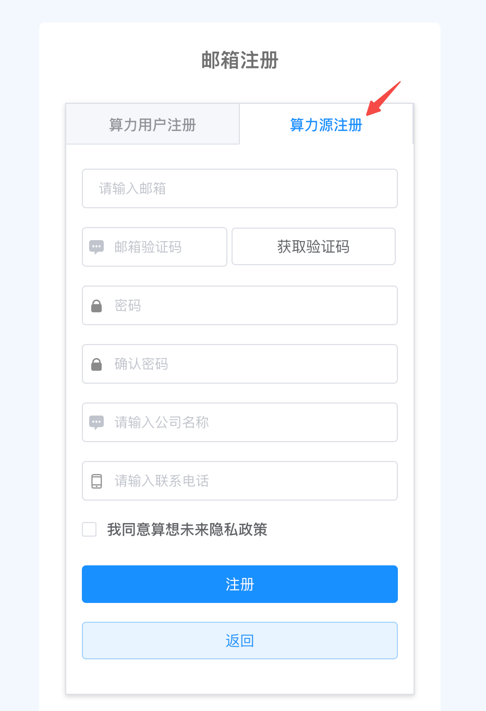

# 算力源指南

## 名词解释
- `算想云`: llm.sxwl.ai，Serverless（无服务器）大模型训练云服务
- `算力源`：指拥有 GPU 裸金属服务器的用户（包括服务器、网络设备等等）
- `CPod`：指一个由[三千平台](../3k/index.md)管理的独立的大模型智算集群；算力源将闲置算力服务器部署成的一个或多个集群，每个集群部署三千平台后，即称为算想云上一个`CPod`
- `accessKey`：指算力源注册后生成的访问密钥，该密钥在部署 CPod 时会用到，并在 CPod 注册到算想云时作为用户标识
> 注：一个用户对应一个 accessKey，一个算力源可以注册多个 CPod

## 注册、登录
在算想云上，拥有闲置算力的用户可以选择在注册成为算力源，将闲置算力加入算想云， 以 Serverless（无服务器）云服务的方式将算力共享出来给大模型训练用户，从而让闲置算力价值变现，实现算力源、算力用户的双赢。

### 注册
- 登录 https://llm.sxwl.ai ，选择`注册`


- 选择`算力源注册`并填写注册相关信息，点击`注册`完成用户注册


### 登录
- 以注册的用户登录系统，可以看到当前用户的注册信息以及`accessKey`，复制`accessKey`备用

- 此时`算力详情`页面显示为空，待部署`CPod`后，算力源相关信息将注册并上报至算想云，届时可看到算力详情信息


## 部署、算力详情
### 部署CPod
1. 生成密钥对并配置节点间互信
```bash
# 生成密钥对
ssh-keygen -t rsa

# 配置节点间互信
ssh-copy-id master1
ssh-copy-id master2
ssh-copy-id master3
ssh-copy-id worker1
ssh-copy-id worker2
ssh-copy-id worker3
```

2. 下载并解压离线安装包
```bash
cd /opt
wget https://sxwl-ai.oss-cn-beijing.aliyuncs.com/antifacts/3k-artifact.tgz
tar xvf 3k-artifact.tgz && cd artifact
```

3. 修改集群配置文件`conf/config-sample.conf`，按实际集群节点信息填写
```yaml
hosts:
  - {name: master1, internalAddress: 192.168.1.1, port: 22, user: root, privateKeyPath: "/root/.ssh/id_rsa"}
  - {name: master2, internalAddress: 192.168.1.2, port: 22, user: root, privateKeyPath: "/root/.ssh/id_rsa"}
  - {name: master3, internalAddress: 192.168.1.3, port: 22, user: root, privateKeyPath: "/root/.ssh/id_rsa"}
  - {name: worker1, internalAddress: 192.168.1.4, port: 22, user: root, privateKeyPath: "/root/.ssh/id_rsa"}
  - {name: worker2, internalAddress: 192.168.1.5, port: 22, user: root, privateKeyPath: "/root/.ssh/id_rsa"}
  - {name: worker3, internalAddress: 192.168.1.6, port: 22, user: root, privateKeyPath: "/root/.ssh/id_rsa"}
  roleGroups:
    etcd:
    - master[1:3]
    control-plane:
    - master1
    worker:
    - worker[1:3]
    registry:
    - master1
```

4. 部署`CPod`，此处`ACCESS_KEY`的值为用户在算想云注册后生成的`accessKey`
```bash
ACCESS_KEY=
sudo ./3kctl deploy all --access-key=${ACCESS_KEY}
```

5. 按需部署`ceph`集群
```bash
sudo ./3kctl deploy install ceph
```

6. 查看集群信息
```bash
kubectl get pods -A
```


### 算力源详情
此时算力源详情页面将显示 CPod 上报的算力源信息：
